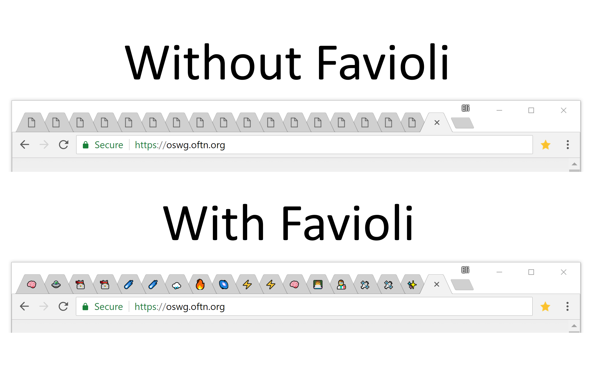
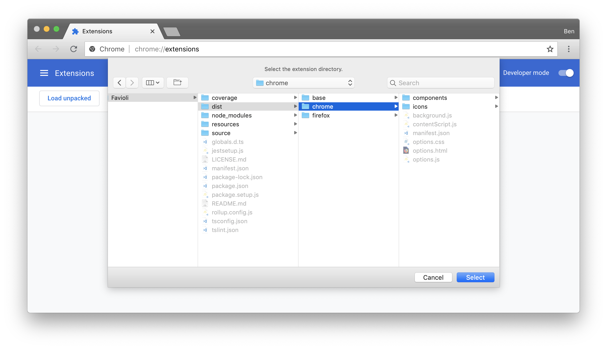
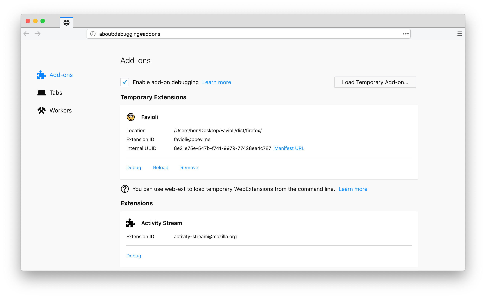

Favioli 🤯
=======

<p align="center">
Making the world a better place or something. Favioli adds emoji FavIcons for websites that lack one. This README is for Favioli contribution information. Read the <a href="https://bpev.me/favioli">Favioli introduction blog post</a> for more information about why Favioli exists, or click the badges for your Chrome and Firefox downloads.
</p>

<p align="center">
  <a href="https://chrome.google.com/webstore/detail/favioli/pnoookpoipfmadlpkijnboajfklplgbe">
    
  </a>
  <a href="https://addons.mozilla.org/en-US/firefox/addon/favioli/">
    
  </a>
</p>




Development
===========
<p>
  <a href="https://david-dm.org/ivebencrazy/favioli">
    
  </a>
  <a href="https://david-dm.org/ivebencrazy/favioli?type=dev">
    
  </a>
  <a href="https://travis-ci.org/ivebencrazy/favioli">
    
  </a>
</p>

Favioli should work with any recent [Node.js](https://nodejs.org/en/) version; I'm currently using `v10.5.0` on Mac OS High Sierra for development. We run tests in Favioli with [Jest](https://jestjs.io/).  Run Jest tests with our test script.

```sh
# Install dependencies
npm install

# Run tests
npm test

# Alternatively, run just a piece of testing
npm run test:lint
npm run test:unit

# Start building for development
npm start
```

This will build our distribution code into `/dist`, each browser with its own directory. To load Favioli, point to each browser's respective directory. [Google](https://developer.chrome.com/extensions) and [Mozilla](https://developer.mozilla.org/en-US/docs/Mozilla/Add-ons) each have resources about developing for their respective platforms.





Inspiration
==========
- [Emoji-Favicon-Toolkit](https://github.com/eligrey/emoji-favicon-toolkit) by [OFTN Inc.](https://oftn.org) and [Eli Grey](https://eligrey.com)
- [eft-input-modified-indicator.js](https://gist.github.com/eligrey/4df9453c3bc20acd38728ccba7bb7160) by [Eli Grey](https://eligrey.com)
- [Emoji-Selector](https://github.com/Kiricon/emoji-selector) by [Dominic Valenicana](https://dominic.codes/)
