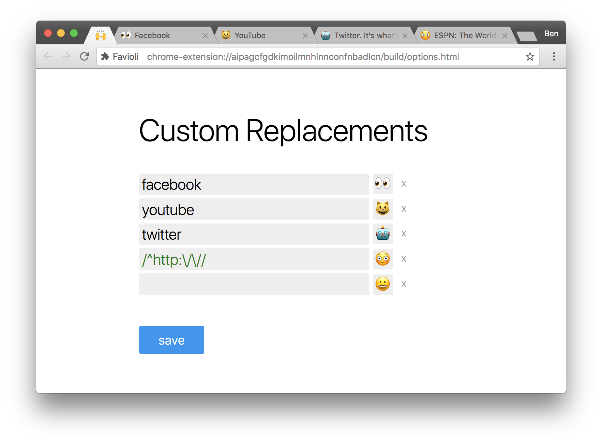

Favioli
=======
Making the world a better place or something. Favioli automatically use an emoji as a favicon for every website that lacks one.

Features
========
- Automatically use an emoji as a favicon for every website that lacks one.
- We always use the same emoji, so you always know which site it is.

- Override custom website hosts by regex or by matching part of the url's host

Inspiration
==========
- [Emoji-Favicon-Toolkit](1) by [OFTN Inc.](2) and [Eli Grey](4)
- [eft-input-modified-indicator.js](3) by [Eli Grey](4)
- [Emoji-Selector](5) by [Dominic Valenicana](6)

[1]: https://github.com/eligrey/emoji-favicon-toolkit
[2]: https://oftn.org
[3]: https://gist.github.com/eligrey/4df9453c3bc20acd38728ccba7bb7160
[4]: https://eligrey.com
[5]: https://github.com/Kiricon/emoji-selector
[6]: https://dominic.codes/
